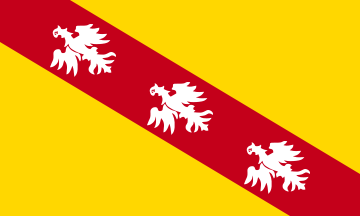

# La Lorraine

[< retour à l'accueil](./index.md)

La Lorraine est une région du Nord-Est de la France, composée des départements suivants :

- la Meurthe-et-Moselle
- [la Meuse](./mon-departement.md)
- la Moselle
- les Vosges

## Villes

Les deux principales villes de Lorraine sont Nancy et Metz.

## A visiter

- la [place Stanislas à Nancy](https://fr.wikipedia.org/wiki/Place_Stanislas)
- le [centre Pompidou à Metz](https://fr.wikipedia.org/wiki/Centre_Pompidou-Metz)
- le [centre thermal et touristique d'Amnéville](https://fr.wikipedia.org/wiki/Amn%C3%A9ville#Centre_thermal_et_touristique)
- la [cristallerie de Baccarat](https://fr.wikipedia.org/wiki/Baccarat#Artisanat)
- le [tourisme autour de la bataille de Verdun](https://fr.wikipedia.org/wiki/Verdun#Lieux_de_m%C3%A9moire_de_la_Grande_Guerre)

[< retour à l'accueil](./index.md)
