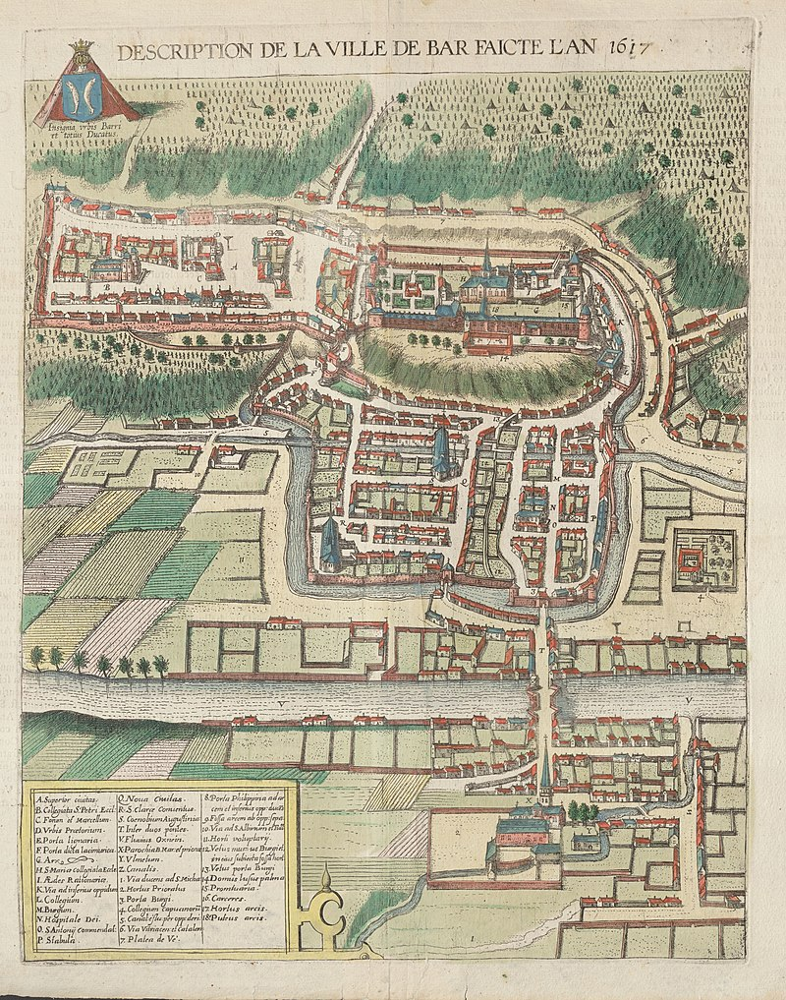
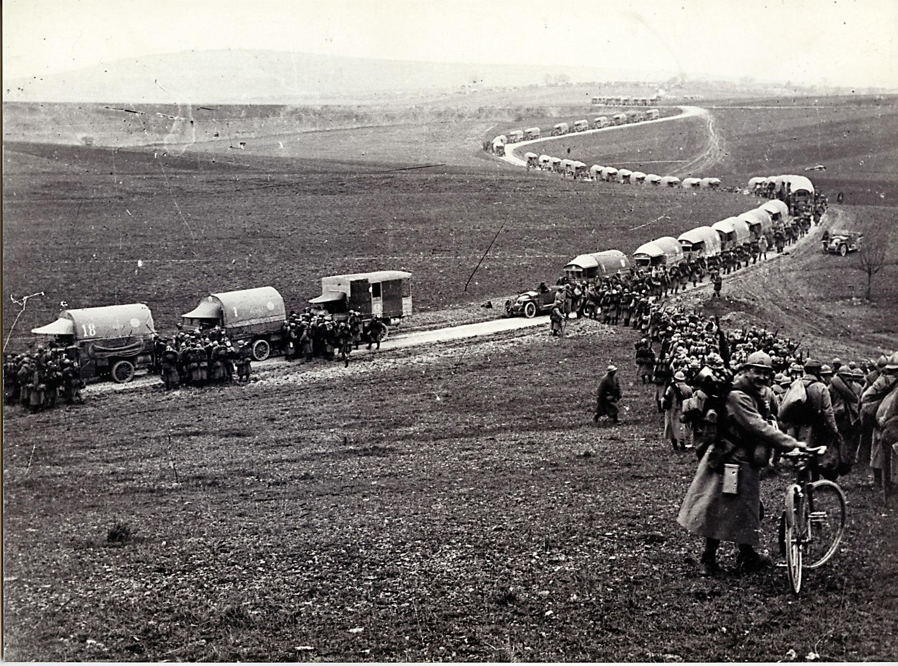
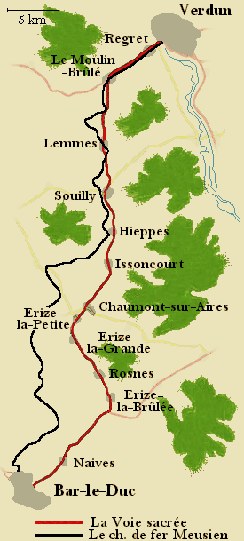
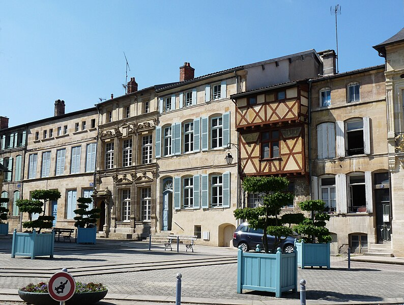
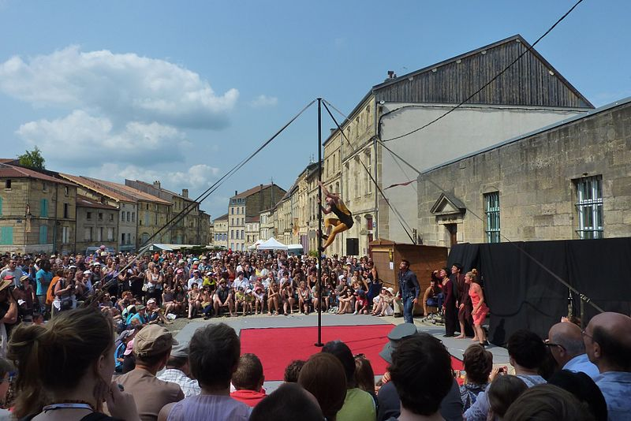
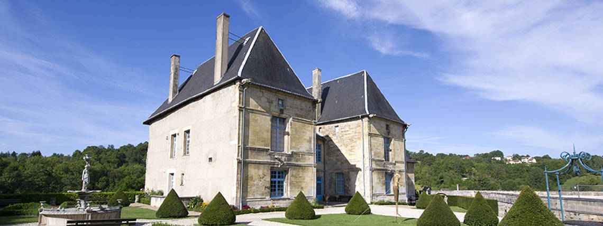

# Bar-Le-Duc

[< retour à l'accueil](./index.md)

Bar-Le-Duc est une ville de moins de 15 000 habitants, située dans le [département de la Meuse](./mon-departement.md) (55) dont elle est le chef-lieu.

Son histoire est liée aux Ducs de Bar et Ducs de Lorraine, à l'origine de la construction du château des Ducs de Bar et de la fortification et des édifices autour, qui forment aujourd'hui le quartier Renaissance.

## Première guerre mondiale

Placée en arrière des lignes, la ville joue un rôle stratégique important. Elle sert de point de départ pour le ravitaillement de la ville de Verdun lors de la **bataille de Verdun** de 1916. Troupes, vivres et matériel empruntent le chemin de fer local _Le Meusien_ (appelé également _Le Varinot_ du nom de son constructeur _Charles Varinot_), et des milliers d'hommes et de camions circulent sans interruption sur la route reliant Bar à Verdun. Cette dernière se verra attribuée le nom de **Voie sacrée** par l'écrivain et homme politique _Maurice Barrès_ dès avril 1916, en référence à l'antique _Via Sacra_ romaine menant au triomphe.

## Personnalités historiques

- [Raymond Poincaré](https://fr.wikipedia.org/wiki/Raymond_Poincar%C3%A9), président de la République française de 1913 à 1920
- [Pierre et Ernest Michaud](https://fr.wikipedia.org/wiki/Pierre_Michaux), inventeurs du pédalier
- [Maréchal Oudinot](https://fr.wikipedia.org/wiki/Nicolas_Charles_Oudinot), général français de la Révolution et le l'Empire

## Personnalités comptemporaines

- [Sophie Thalmann](https://fr.wikipedia.org/wiki/Sophie_Thalmann), sacrée Miss France en 1998
- [Anaïs Delva](https://fr.wikipedia.org/wiki/Ana%C3%AFs_Delva), chanteuse principalement connue pour la chanson "Libérée, délivréee"

## A Visiter

- le [quartier Renaissance](https://www.tourisme-barleducsudmeuse.fr/Patrimoine-Renaissance), avec la tour de l'horloge, le château des Ducs de Bar, l'église Saint-Etienne et ses bâtiments à l'architecture renaissance
- le [festival Renaissance](https://fr.wikipedia.org/wiki/Festival_RenaissanceS)
- le [musée Barrois](https://fr.wikipedia.org/wiki/Ch%C3%A2teau_des_ducs_de_Bar#Le_Mus%C3%A9e_Barrois), situé dans l'ancien château des Ducs de Bar

[< retour à l'accueil](./index.md)
